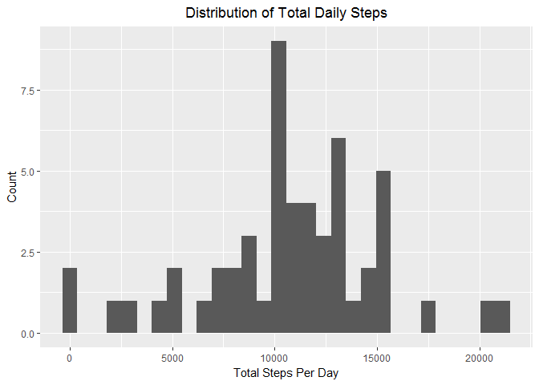
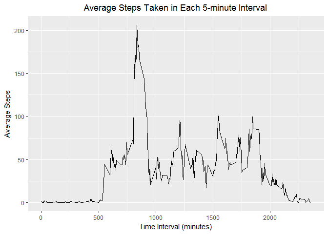
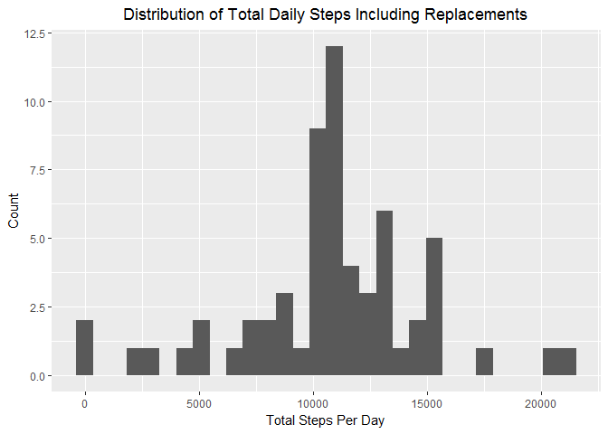
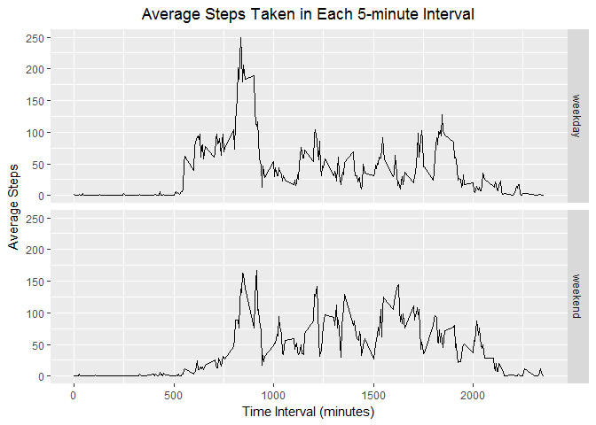

# Reproducible Research: Peer Assessment 1


## Loading and preprocessing the data  

Read in data and convert date variable form factor to date:

```r
activity <- read.csv("activity.csv")
activity$date <- as.Date(as.character(activity$date), format = "%Y-%m-%d")
```


## What is mean total number of steps taken per day?  

Create data frame of total steps per day:

```r
dailySteps <- aggregate(steps ~ date, data = activity, FUN = sum, na.rm = TRUE)
```

Plot histogram of steps per day:

```r
library(ggplot2)
ggplot(data = dailySteps, aes(steps))+geom_histogram(bins = 30)+labs(title = "Distribution of Total Daily Steps", x = "Total Steps Per Day", y = "Count")+theme(plot.title = element_text(hjust = 0.5))
```

<!-- -->

Calculate mean and median of steps per day:

```r
meanSteps <- mean(dailySteps$steps)
medianSteps <- median(dailySteps$steps)
```

Mean steps per day = 1.0766189\times 10^{4}
Median steps per day = 10765
  
  
## What is the average daily activity pattern?  

Calculate mean of steps taken during each 5-minute interval across all days in dataset:

```r
patternSteps <- aggregate(steps ~ interval, data = activity, mean)
maxSteps <- max(patternSteps$steps)
maxInterval_lower <- patternSteps$interval[patternSteps$steps == maxSteps]
maxInterval_upper <- maxInterval_lower + 5
```

Plot time series of average daily steps for each time interval:

```r
ggplot(patternSteps, aes(interval,steps))+geom_line()+labs(title = "Average Steps Taken in Each 5-minute Interval", x = "Time Interval (minutes)", y = "Average Steps")+theme(plot.title = element_text(hjust = 0.5))
```

<!-- -->

On average, the most steps were taken between 835 and 840 minutes.
  
  
## Imputing missing values  

Calculate the total number of missing values:

```r
na <- sum(!complete.cases(activity))
```

There are 2304 missing values in the steps variable.

Replace NAs with the mean steps for the corresponding interval:

```r
complete <- activity
complete$intmean <- patternSteps$steps
for(i in seq_along(complete$steps)){
  if(is.na(complete$steps[i])){
    complete$steps[i] <- complete$intmean[i]
  }
}
complete <- complete[,1:3]
```

Create data frame of total steps per day including replacements:

```r
dailySteps2 <- aggregate(steps ~ date, data = complete, FUN = sum, na.rm = TRUE)
```

Re-plot histogram of steps per day:

```r
ggplot(data = dailySteps2, aes(steps))+geom_histogram(bins = 30)+labs(title = "Distribution of Total Daily Steps Including Replacements", x = "Total Steps Per Day", y = "Count")+theme(plot.title = element_text(hjust = 0.5))
```

<!-- -->

Re-calculate mean and median of steps per day:

```r
meanSteps2 <- mean(dailySteps2$steps)
medianSteps2 <- median(dailySteps2$steps)
```

Mean steps per day excluding missing values = 1.0766189\times 10^{4}
Mean steps per day replacing missing values = 1.0766189\times 10^{4}

Median steps per day excluding missing values = 10765
Median steps per day replacing missing values = 1.0766189\times 10^{4}
  
  
## Are there differences in activity patterns between weekdays and weekends?  

Create new factor variable denoting weekday or weekend:

```r
complete$day <- weekdays(complete$date, abbreviate = TRUE)
phase <- c(rep("weekday", times = 5), rep("weekend", times = 2))
names(phase) <- c("Mon", "Tues", "Wed", "Thurs", "Fri", "Sat", "Sun")
complete$phase <- phase[as.character(complete$day)]
complete$phase <- as.factor(complete$phase)
```

Create panel plot of average steps for each time interval comparing weekdays and weekends:

```r
completePattern <- aggregate(steps ~ interval + phase, data = complete, mean)
ggplot(completePattern, aes(interval,steps))+geom_line()+facet_grid(phase~.)+labs(title = "Average Steps Taken in Each 5-minute Interval", x = "Time Interval (minutes)", y = "Average Steps")+theme(plot.title = element_text(hjust = 0.5))
```

<!-- -->
